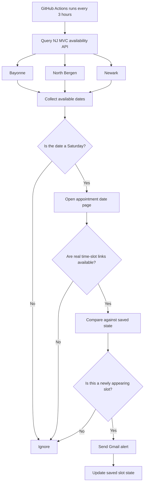

# NJ MVC Saturday Appointment Monitor

A lightweight Python automation that monitors **New Jersey MVC appointment availability** and sends an email alert when a **new Saturday appointment** becomes available at selected MVC locations.

## Overview

NJ MVC appointment availability can change quickly, and manually checking multiple locations throughout the day is repetitive.

This project automates that workflow by:

- querying NJ MVC's live appointment availability
- monitoring only selected locations
- filtering specifically for Saturday appointments
- verifying that actual appointment times are available
- preventing duplicate alerts for the same slot
- sending an email only when a new qualifying slot appears
- running automatically in GitHub Actions every 3 hours

The monitor does **not** automatically book appointments.

## Monitored Locations

| Location | NJ MVC Location ID |
|---|---:|
| Bayonne | `210` |
| North Bergen | `224` |
| Newark | `223` |

Appointment type:

```text
Non-Driver ID
Appointment ID: 16
```

## How It Works



## Why the Extra Verification Step?

The calendar endpoint indicates which **dates** are available, but the monitor does not alert based on the date alone.

For every Saturday candidate, it also loads the corresponding appointment page and verifies that **real selectable appointment-time links** exist.

This reduces the chance of false-positive alerts.

## Features

- **Live NJ MVC availability checks**
- **Saturday-only filtering**
- **Multiple location monitoring**
- **Actual time-slot verification**
- **Duplicate-alert prevention**
- **Gmail SMTP notifications**
- **GitHub Actions scheduling**
- **No always-on local machine required**
- **No browser automation or Selenium required**
- **No automatic appointment booking**
- **Credentials stored as GitHub Actions Secrets**

## Project Structure

```text
njmvc-saturday-monitor/
│
├── njmvc_monitor_github.py
├── njmvc_state.json
│
└── .github/
    └── workflows/
        └── check_njmvc.yml
```

### `njmvc_monitor_github.py`

Core monitoring logic.

It:

1. queries available dates for each configured NJ MVC location
2. filters dates to Saturdays
3. verifies actual appointment time slots
4. compares them with previously observed slots
5. sends an email for newly appearing availability

### `njmvc_state.json`

Stores the currently observed appointment slots.

This allows the monitor to distinguish between:

```text
same slot still available
→ no additional email
```

and:

```text
new slot appears
→ send alert
```

If a slot disappears and later becomes available again, it can be treated as new availability.

### `.github/workflows/check_njmvc.yml`

Runs the monitor automatically through GitHub Actions.

Current cadence:

```text
Every 3 hours
America/New_York
```

The workflow can also be triggered manually from the **Actions** tab for testing.

## NJ MVC Availability Endpoint

The monitor uses the same availability endpoint used by the NJ MVC appointment calendar:

```text
/njmvc/CustomerCreateAppointments/GetAvailableDatesForMonth
```

with parameters such as:

```text
duration=15
locationId=<LOCATION_ID>
appointmentId=16
date=<MONTH>
```

A typical response contains available dates:

```json
[
  "2026-09-02T00:00:00",
  "2026-09-09T00:00:00"
]
```

The script then determines whether any returned date falls on a Saturday.

## Alert Logic

An email is sent only when **all** of the following are true:

```text
Location is monitored
        ↓
Appointment type is Non-Driver ID
        ↓
Available date is Saturday
        ↓
Actual appointment time is verified
        ↓
Slot was not already active in saved state
        ↓
EMAIL ALERT
```

Routine checks with no new Saturday availability remain silent.

## Email Notifications

Notifications are sent directly through Gmail SMTP.

Example alert:

```text
Subject: NJ MVC SATURDAY SLOT FOUND

A new NJ MVC Saturday Non-Driver ID appointment is available.

Bayonne — Saturday, September 5, 2026
Times: 8:15 AM EDT, 8:30 AM EDT, 9:00 AM EDT

Book:
https://telegov.njportal.com/...
```

## Setup

### 1. Fork or Clone the Repository

```bash
git clone https://github.com/YOUR_USERNAME/njmvc-saturday-monitor.git
cd njmvc-saturday-monitor
```

### 2. Create a Gmail App Password

The project uses Gmail SMTP rather than storing a normal Google password.

Create a Google **App Password** for the Gmail account that should send and receive alerts.

### 3. Add GitHub Actions Secrets

In the repository:

```text
Settings
→ Secrets and variables
→ Actions
→ New repository secret
```

Create:

```text
GMAIL_ADDRESS
```

with your Gmail address.

Then create:

```text
GMAIL_APP_PASSWORD
```

with the Google App Password.

Never commit either value to the repository.

## Testing the Workflow

The workflow supports manual execution.

Go to:

```text
GitHub Repository
→ Actions
→ NJ MVC Saturday Monitor
→ Run workflow
```

### Test Email

Enable:

```text
Send only a test email
```

This verifies that GitHub Actions can authenticate with Gmail without querying NJ MVC.

### Test the Real Monitor

Run the workflow with the test-email option disabled.

A successful run with no Saturday availability will look similar to:

```text
Bayonne: 0 verified Saturday time slot(s).
North Bergen: 0 verified Saturday time slot(s).
Newark: 0 verified Saturday time slot(s).

No new Saturday slots. No email sent.
```

## Scheduling

The workflow is currently configured to run every 3 hours.

Example:

```yaml
schedule:
  - cron: "17 */3 * * *"
    timezone: "America/New_York"
```

The non-zero minute helps avoid scheduling everything exactly at the start of the hour.

To change the cadence, edit:

```text
.github/workflows/check_njmvc.yml
```

## Security

Sensitive credentials are **never stored in the Python source code**.

The project uses:

```text
GitHub Actions Secrets
        ↓
Environment variables
        ↓
Python process
        ↓
Gmail SMTP
```

The Gmail App Password should never be committed to Git, included in logs, screenshots, or added to `njmvc_state.json`.

## Local Testing

The monitor can also be run locally:

```bash
export GMAIL_ADDRESS="your-email@gmail.com"
export GMAIL_APP_PASSWORD="your-app-password"

python3 njmvc_monitor_github.py
```

To test email delivery only:

```bash
python3 njmvc_monitor_github.py --test-email
```

## Customizing Locations

Locations are configured in:

```python
LOCATIONS = {
    "Bayonne": 210,
    "North Bergen": 224,
    "Newark": 223,
}
```

Additional NJ MVC locations can be added if their location IDs are known.

## Design Decisions

### Why GitHub Actions?

Running the monitor locally means availability checks stop whenever the laptop sleeps or shuts down.

GitHub Actions provides a lightweight hosted execution environment, allowing the monitor to continue running independently of a personal computer.

### Why Not Selenium or Playwright?

The NJ MVC calendar exposes structured availability data, so full browser automation is unnecessary.

Using the underlying HTTP responses makes the monitor:

- faster
- simpler
- easier to maintain
- less resource-intensive

### Why Maintain State?

Without persisted state, every scheduled GitHub runner would start from scratch and could repeatedly alert for an appointment that had already been reported.

`njmvc_state.json` provides lightweight persistence between workflow runs.

## Limitations

- Appointment availability can change between an alert being sent and the user opening the booking page.
- GitHub Actions scheduled workflows are not intended for second-by-second monitoring.
- Changes to the NJ MVC website or its appointment endpoints may require updates to the parser.
- The project detects availability but intentionally does not reserve or book appointments.

## Future Improvements

Potential enhancements include:

- configurable locations through environment variables
- Telegram, SMS, or push notifications
- configurable weekdays
- configurable appointment types
- monitoring-frequency controls
- Docker deployment
- serverless deployment
- structured logging
- health-check notifications
- a small dashboard showing recent availability history

## Tech Stack

```text
Python 3
GitHub Actions
GitHub Secrets
Gmail SMTP
HTTP / JSON
HTML parsing
```

The implementation intentionally uses Python's standard library and does not require third-party packages.

## Disclaimer

This is an independent personal automation project and is **not affiliated with, endorsed by, or operated by the New Jersey Motor Vehicle Commission or TeleGov**.

Users should follow the applicable website terms and use reasonable polling intervals.

---

Built as a practical automation project for reducing repetitive appointment checking while keeping the final booking decision in the user's hands.
